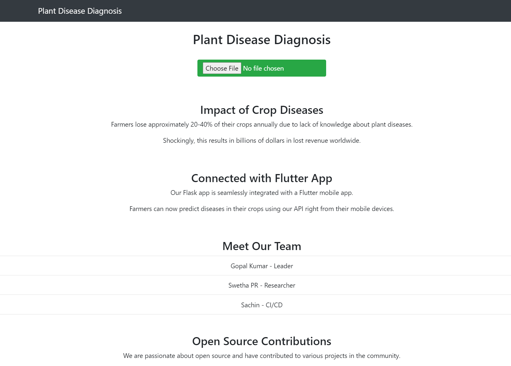

# Plant-Disease-Diagnosis-Flask
Online Flask Web App for Plant Disease Diagnosis from Images <br>

<br><br>

## Required Tools
```
Python 3.6 or greater, Tensorflow 2, Flask, Gevent, Scikit-Learn

OR

run Requirements.txt
```

## Run
```
flask run
```

Open Browser at http://121.0.0.1:5000

## Dataset

https://www.kaggle.com/emmarex/plantdisease


## Implementation


https://www.kaggle.com/code/gopalkumar0/plant-disease-classification-using-densenet121


